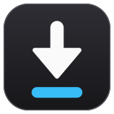
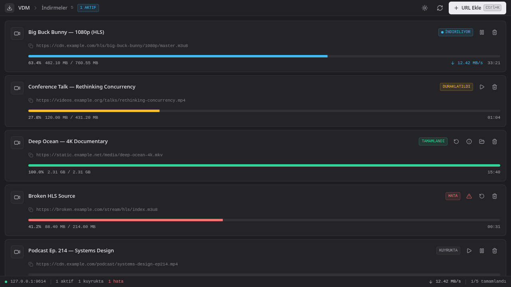
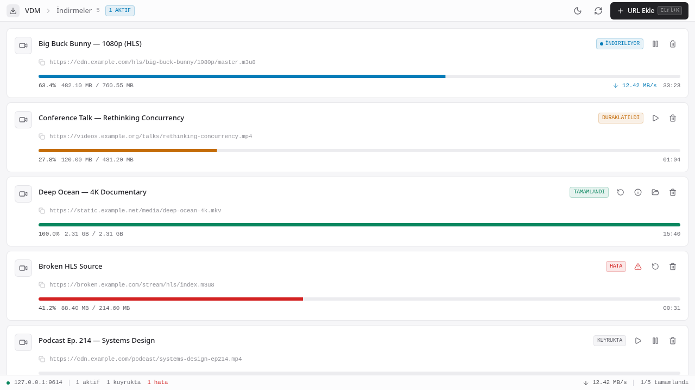
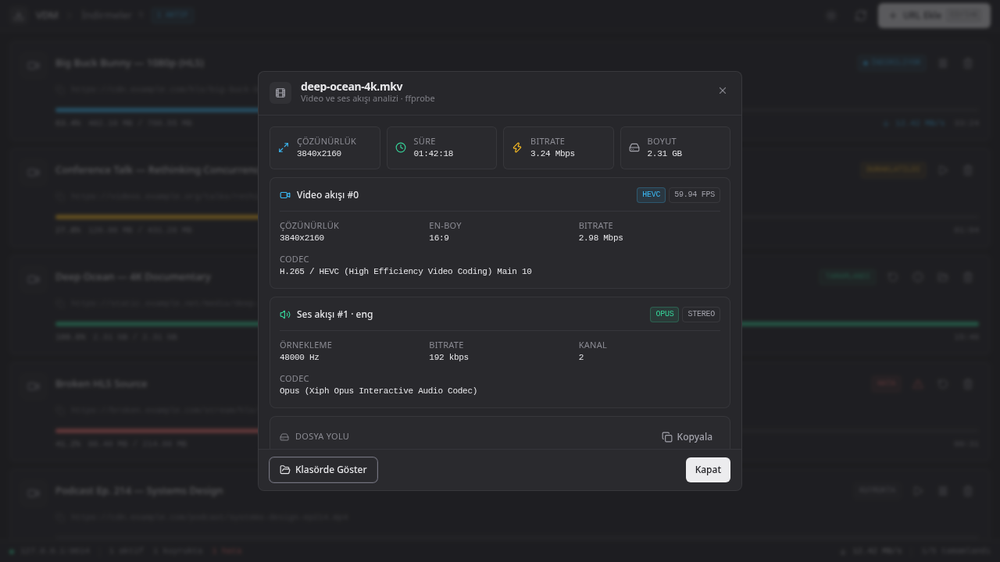
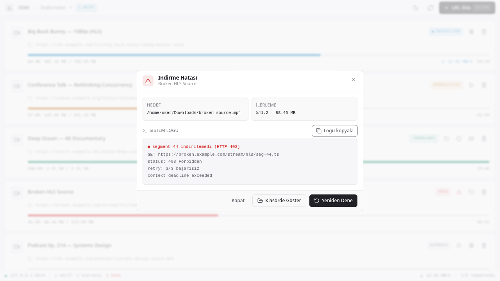
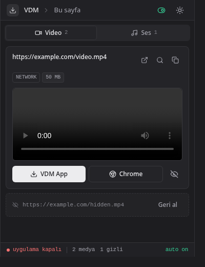
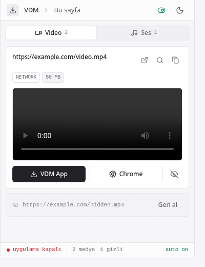
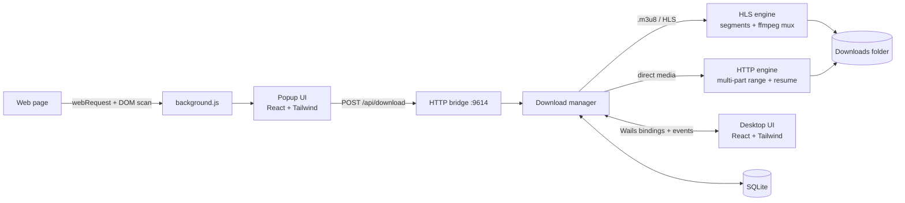

<div align="center">



# VDM — Video Download Manager

**Capture streaming video from your browser, download it natively, and manage every download from a compact desktop app.**

A Chrome extension sniffs media requests on the pages you visit and hands them to a Go/Wails desktop app that downloads them with its own HLS and HTTP engines — no external downloader binaries required.




</div>

---

## Highlights

- **Automatic capture** — the extension watches network traffic and in-page `<video>` tags, so HLS (`.m3u8`), DASH, MP4 and WebM streams show up without copying URLs by hand.
- **Native download engines** — multi-part HTTP range downloads with resume, plus a built-in HLS engine that parses playlists, fetches init segments, and muxes with ffmpeg when it is available.
- **Queue that behaves** — two active downloads at a time, the rest queued with visible positions; pause, resume and retry per item.
- **Media analysis** — ffprobe-backed inspection of the finished file: container, duration, bitrate, and every video/audio stream.
- **Survives restarts** — downloads are persisted in SQLite, and the app can rescan your Downloads folder to rebuild history.
- **Desktop-grade UI** — compact 40px title strip, keyboard shortcuts, a live status bar, and light/dark themes you can switch at any time.

## Screenshots

| Desktop — dark | Desktop — light |
| --- | --- |
|  |  |

| Media analysis (ffprobe) | Error details with the system log |
| --- | --- |
|  |  |

<div align="center">

| Extension popup — dark | Extension popup — light |
| --- | --- |
|  |  |

</div>

The popup splits captures into **Video** and **Ses** (audio) tabs, previews them inline, and sends them to the desktop app — or downloads them straight through Chrome.

## How it works



The desktop app is both the GUI and the server: on start it listens on `127.0.0.1:9614` for the extension, while the window talks to the same manager through Wails bindings and live events.

## Requirements

| | Needed for | Notes |
| --- | --- | --- |
| **ffmpeg** | HLS muxing (video + audio into one file) | Optional but recommended. Without it, HLS downloads fall back to direct segment concatenation. |
| **ffprobe** | The media analysis panel | Ships with ffmpeg. |
| **Go 1.25+**, **Node.js**, **pnpm** | Building from source | Not needed if you run a prebuilt binary. |

```bash
# Arch / CachyOS
sudo pacman -S ffmpeg

# Debian / Ubuntu
sudo apt install ffmpeg

# macOS
brew install ffmpeg

# Windows
winget install Gyan.FFmpeg
```

## Install

### 1. Desktop app

Run a prebuilt binary, or build from source:

```bash
go install github.com/wailsapp/wails/v3/cmd/wails3@latest

# Linux build dependencies
sudo pacman -S base-devel gtk4 webkitgtk-6.0          # Arch-based
sudo apt install libgtk-4-dev libwebkitgtk-6.0-dev build-essential   # Debian/Ubuntu
# macOS: xcode-select --install     Windows: C++ Build Tools

cd desktop
wails3 build      # output: desktop/bin/
```

Cross-compile every platform at once with Docker (`vdm-windows-amd64.exe`, `vdm-linux-amd64`, `vdm-macos-arm64`, `vdm-macos-amd64` into `desktop/releases/`):

```bash
chmod +x build.sh
./build.sh
```

### 2. Chrome extension

```bash
cd extension/popup-app && pnpm install && pnpm build   # or: ./build-extension.sh (Docker)
```

1. Open `chrome://extensions/` and enable **Developer mode**.
2. Click **Load unpacked** and pick the **`extension/`** folder (the one with `manifest.json`).
3. Pin the icon to the toolbar.

## Usage

1. Start the desktop app — it begins listening on port `9614`.
2. Browse to a page with video. The extension badge shows how many streams it captured.
3. Open the popup, pick the **Video** or **Ses** tab, and hit **VDM App** to download through the desktop app (or **Chrome** for a plain browser download).
4. Track progress, pause/resume, inspect media info, or reveal the file in your file manager from the app.

Files land in your system **Downloads** folder.

### Keyboard shortcuts

| Shortcut | Action |
| --- | --- |
| <kbd>Ctrl</kbd>/<kbd>⌘</kbd> + <kbd>K</kbd> | Add a download by URL |
| <kbd>Ctrl</kbd>/<kbd>⌘</kbd> + <kbd>R</kbd> | Rescan the Downloads folder |
| <kbd>Esc</kbd> | Close the open dialog |

## Project layout

```
xdm/
├── desktop/                 Go + Wails v3 app  →  see desktop/README.md
│   ├── manager.go           queue, state, events
│   ├── direct.go            multi-part HTTP range downloader
│   ├── hls.go               HLS playlist parsing, segments, muxing
│   ├── server.go            HTTP bridge for the extension (:9614)
│   └── frontend/            React 19 + Tailwind + shadcn/ui
├── extension/               Chrome MV3 extension  →  see extension/README.md
│   ├── background.js        capture, badge, storage
│   ├── content.js           in-page <video> and title detection
│   └── popup-app/           React popup (built into popup-dist/)
├── assets/icon.svg          app icon master
└── build.sh                 Docker cross-compile for all platforms
```

## Development

```bash
# Desktop app with hot reload (Go + frontend)
cd desktop && wails3 dev

# Frontend only
cd desktop/frontend && pnpm dev

# Extension popup only
cd extension/popup-app && pnpm dev
```

Both frontends share the same checks:

```bash
pnpm lint        # Biome: lint + format
pnpm typecheck   # tsc -b (project references)
pnpm build       # production bundle
```

Pre-commit hooks (Biome for TS/React, `golangci-lint` for Go) are wired through `.githooks`. Running `pnpm install` in the repo root configures them; to enable them by hand:

```bash
git config core.hooksPath .githooks
chmod +x .githooks/pre-commit
```

## Known limitations

- **YouTube page URLs are not downloadable yet.** The extension detects them and can open them in a tab, but the desktop engines only handle direct media and HLS playlists — there is no yt-dlp integration.
- DRM-protected streams (Widevine and friends) are out of scope.
- The app UI is currently Turkish only.
